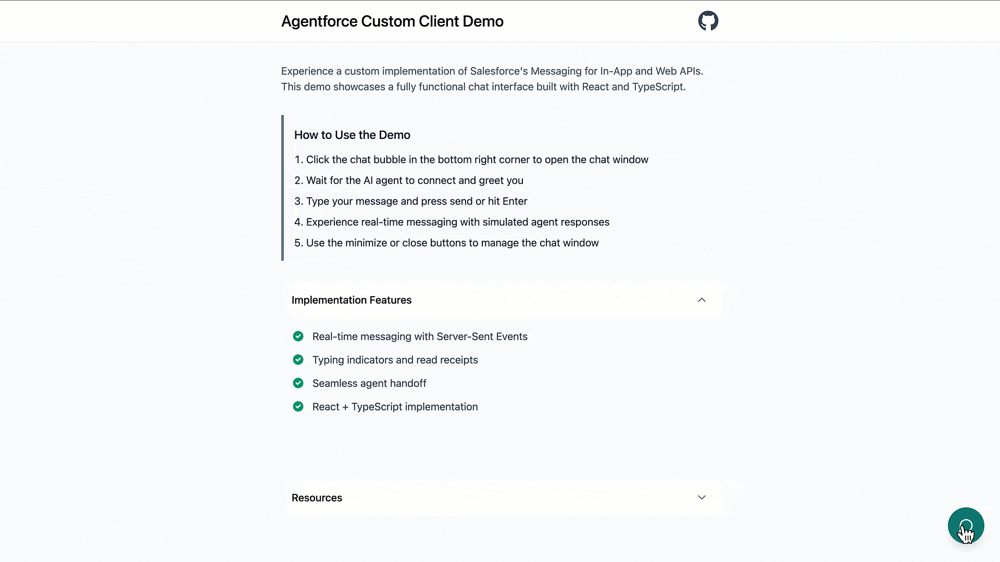

# Agentforce Custom Chat Client

A modern React-based chat interface implementation for Salesforce's Messaging for In-App and Web APIs, designed to work with Agentforce Service Agents. Built with React, TypeScript, Tailwind CSS, and Fastify.

[🎥 Watch the Demo Video](https://youtu.be/Ip2d_jay7H0?si=W3kMhn1-fKOKAn_X)



## Features

- 💬 Real-time messaging using Server-Sent Events (SSE)
- 📝 Live typing indicators
- 🎙️ Voice input support with speech recognition
- 🌓 Light/dark theme support
- 📱 Fully responsive design

## Prerequisites

- Node.js >= 20.0.0
- pnpm >= 8.x
- A Salesforce org with Messaging for In-App and Web configured
- An Agentforce Service Agent deployment

## Quick Start

1. Clone the repository:

```bash
git clone https://github.com/charlesw-salesforce/agentforce-custom-client.git
cd agentforce-custom-client
```

2. Install dependencies:

```bash
pnpm install
```

3. Configure environment variables:

```bash
cd server
cp .env.example .env
```

Update `.env` with your Salesforce credentials:

```env
SALESFORCE_SCRT_URL=your-scrt-url
SALESFORCE_ORG_ID=your-org-id
SALESFORCE_DEVELOPER_NAME=your-developer-name
PORT=8080
```

4. Start development servers:

```bash
# Start both client and server
pnpm dev

# Or start individually:
pnpm dev:client   # Client at http://localhost:5173
pnpm dev:server   # Server at http://localhost:8080
```

## Available Scripts

- `pnpm dev` - Start both client and server in development mode
- `pnpm dev:client` - Start client development server
- `pnpm dev:server` - Start backend development server
- `pnpm build` - Build both client and server
- `pnpm start` - Start production server

## Environment Variables

### Server

| Variable                    | Description                 | Required |
| --------------------------- | --------------------------- | -------- |
| `SALESFORCE_SCRT_URL`       | Salesforce SCRT URL         | Yes      |
| `SALESFORCE_ORG_ID`         | Salesforce Organization ID  | Yes      |
| `SALESFORCE_DEVELOPER_NAME` | Salesforce Developer Name   | Yes      |
| `PORT`                      | Server port (default: 8080) | No       |

### Client

| Variable       | Description     | Required |
| -------------- | --------------- | -------- |
| `VITE_API_URL` | Backend API URL | Yes      |

## Setting Up Your Salesforce Organization

1. Create and deploy an Agentforce Service Agent ([video tutorial](https://www.youtube.com/live/1vuZfPEtuUM?si=lQKYsVE9PQrEICNA))
2. [Create a Custom Client](https://help.salesforce.com/s/articleView?id=service.miaw_deployment_custom.htm&type=5) deployment using your messaging channel
3. Copy the SCRT URL, Org ID, and Developer Name to your `.env` file

For detailed setup instructions, follow the [Salesforce documentation](https://help.salesforce.com/s/articleView?id=service.miaw_deployment_custom.htm&type=5).
